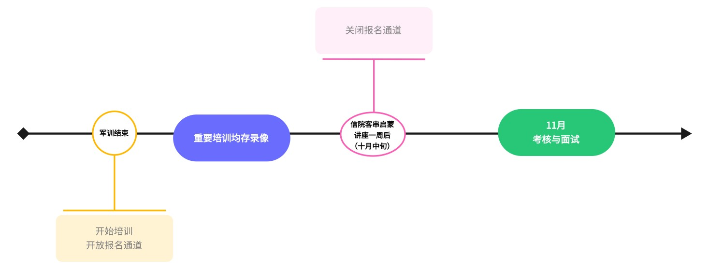
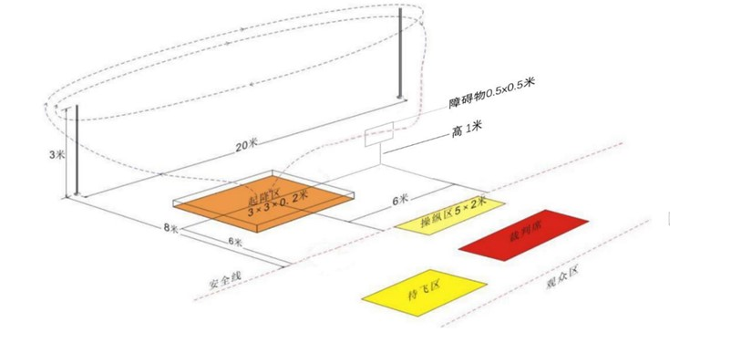

719-HOVER 2022年纳新手册
=========================

声 明
-----------------------------------------
本次纳新规则最终解释权归719飞行器实验室所有。

纳新时间线
-----------------------------------------

A赛道（飞行器设计）纳新方案
-----------------------------------------

1. 参赛对象

仅限哈尔滨工业大学（威海）2021 级和 2022 级学生报名，每个团队人数不超过 3 人。赛前将会有飞行器原理等知识培训。 

1. 任务描述

遥控模型从起降区起飞，顺时针绕标杆飞行两圈，飞行至障碍区上空安全穿过障碍物后，安全返回起降区降落，循环往返直至比赛结束。比赛以限时内有效穿越障碍循环次数大者取胜。 

3. 技术要求 

   1. 模型质量、布局、结构形式等不限，但模型不得有轻于空气的结构部分。 
   #. 模型动力必须为电动。 
   #. 模型起飞不得借助外力或其它装置。 
   #. 起降区内，除模型外不得放置任何设备。 
   #. 每个飞行组在比赛中最多使用 2 架模型。 
   #. 比赛模型必须为自行组装，禁止使用大疆等公司生产的成品无人机，禁止使用直升机。 
   #. 飞控由实验室提供。 

4. 场地设置 

   1. 任务区

      1. 任务区设操纵区（3×2m）、起降区（2×2×0.1m 天井）、障碍区、 标杆（高 2m，相距 10m）。 
      #. 标杆距离操纵区边线垂直距离为 6m。 
      #. 障碍区上方设置边长为 1m 的正方形空心边框障碍，距地面垂直高度为 1m。 
      #. 比赛中操纵员不得离开操纵区。除更换备机外任何人不得进入起降区。

   2. 安全区

      1. 工作区和观众区设置在安全区，比赛场馆内除任务区外均为安全区，以视场地情况划定的区域边线和搭设的安全网为界。

5. 竞赛方法

   1. 比赛进行两轮，取取得的最高分的一次为最终成绩。 
   #. 每轮比赛进场准备时间为 1min，比赛时间为 3min。 
   #. 比赛时间内运动员操纵模型完成若干次起飞、绕标、穿越障碍和降落动作，超过比赛时间完成的动作不予计分。 
   #. 模型的穿越障碍物和飞行

      1. 主机在没有离地的情况下出现故障，允许更换备机进行比赛，主机离地后不允许再使用备机；更换备机不算作接触模型。 
      2. 更换备机需向裁判员申请，获准后方可进行；模型第一次离地后，不得人为取出模型进行维修和调试。所用的时间含在 3min 内。 
   #. 模型的穿越障碍物

      - 模型应顺时针绕标杆飞行两圈才可进行穿越障碍物，模型绕两标杆的外侧，从图示左侧标杆飞向右侧标杆两次后，即为完成两圈飞行。 
   #. 完成一次穿越障碍后，模型应降落在起降区内（与起降区地面有一次接触视为降落完成），任何人员不得进入起降区，不得和模型有任何接触 （包括通过其他物体）。 

6. 成绩评定 

   1. 单轮得分 S 为竞赛时间内的起飞分 S1 与每次飞行的避障分 S2 之和再减去扣分 S3。即 S=S1+S2-S3。 
   #. 起飞分：首次起飞成功得 100 分。 
   #. 单次飞行的障碍分：成功穿越障碍物一次得分 50 分。 
   #. 扣分：如 6.1、6.3.4 条所述。

7. 判罚

   1. 比赛时间内参赛人员第一次与模型发生接触（包括通过其他物体），扣 10 分。 
   #. 有下列情况之一者该轮比赛终止，已取得的成绩有效。

      1. 操纵员双脚离开操纵区。 
      #. 模型第一次离地后，对模型进行维修和调试（无论取出与否）。 
      #. 比赛中，模型因故障无法继续飞行或经裁判员认定不能保证飞行安全。 
      #. 参赛人员第二次与模型发生接触（包括通过其他物体）。 
   #. 有下列情况之一者该轮成绩判为零分。

      1. 模型未按规定绕杆飞行两圈且进行了穿越障碍。 
      #. 比赛时间到仍继续向障碍区飞行。 
      #. 模型借助外力或其他装置起飞。 
      #. 模型在穿越障碍时与障碍物接触两次（第一次警告且扣 10 分）。 

8. 组别划分

   - 通过考核后，根据个人意愿以及综合考虑，决定成员组别。

B赛道（机械）纳新方案
-----------------------------------------

1. 参赛对象 

   - 仅限哈尔滨工业大学（威海）2021 级和 2022 级学生报名，本项目为个人参赛，赛前将会有 CAD 等软件相关培训。 

2. 任务描述

   - 在限定时间内，按指定要求
      1. 卷面作答飞行器通识试卷一份；
      #. CAD绘制二维模型、Solidworks/UGNX/Catia绘制三维模型并装配。

3. 技术要求

   1. 比赛为现场进行，会有监督，不得携带已画好的模型参加比赛。 
   #. 要求画出的 CAD 图纸能够满足切割组装要求并能完成一些结构功能。 
   #. 不得携带个人的电子设备。 

4. 场地设置 

   - 海空天立体观测实验大楼 3 楼 719 飞行器实验室（T301-302） 

5. 竞赛方法 

   1. 比赛进行一轮。 
   #. 每轮比赛进场准备时间为 1min，比赛时间为 90min。 
   #. 根据报名人数随机分组，每组同时进行比赛，其余组在场外等候或按规定时间到来。 

6. 成绩评定 

   - 按制图习惯、制图质量、实用程度进行评分，占比60%，飞行器通识卷面成绩，占比40%。满分 100 分。 

7. 判罚 

   1. 比赛时携带个人电子设备入场，一经发现，取消比赛资格。 
   #. 比赛时交头接耳，环顾四周，扣 50 分。

8. 其他

   - 2021级与2022级考核方式一致，难度高于2022级。

C赛道（电控）纳新方案
-----------------------------------------

1. 参赛对象

   - 仅限哈尔滨工业大学（威海）2021 级和 2022 级学生报名，本项目为个人参赛，赛前将会有 C 语言基础知识培训。

2. 任务描述 

   - 在限定时间内，按指定要求，作答一份电子试卷。

3. 技术要求 

   1. 电子试卷的题目分为无人机通识题目、单片机题目（stm32）和算法题目。
   #. 相应的，需要了解的知识分为：无人机基础（例如无人机的分类、无人机的控制机理、飞机上的传感器等）、单片机题目（包括GPIO、串口、IIC、定时器、中断、SPI）、算法题目（pid算法、其它c语言算法）。
   #. 其中只有算法题目需要敲代码。
   #. 本次测试为电子试卷，需自带电脑。

4. 场地设置 

   - 海空天立体观测实验大楼 3 楼 719 飞行器实验室（T301-302）

5. 竞赛方法 

   1. 比赛进行一轮。 
   #. 每轮比赛进场准备时间为 5min，比赛时间为 120min。 
   #. 根据报名人数随机分组，每组同时进行比赛，其余组在场外等候或按规定时间到来。 

6. 成绩评定 

   - 按编程习惯、运行情况、完成程度进行评分，满分 100 分。 

7. 判罚 

   1. 比赛时携带个人电子设备入场，一经发现，取消比赛资格。 
   #. 比赛时交头接耳，环顾四周，扣 50 分。 

8. 其他

   - 2021级与2022级考核方式一致，难度高于2022级。

S赛道（赛务）纳新方案
-----------------------------------------

1. 参赛对象 

   - 仅限哈尔滨工业大学（威海）2021 级和 2022 级学生报名，采取一面→考察→二面的形式。

2.	面试与考察期

   1. 一轮面试在国庆后进行，按2:1选拔预备成员。
   #. 考察期为一个月，根据个人意愿参与实验室日常工作，如发票整理、日常宣传（摄影、视频、文案等）、撰写商业计划书等工作，并对此予以考核。
   #. 考察期结束进行工作汇报与二轮面试。

3. 评定方式 

   - 根据两次面试与考察期的表现，确定最终录用名单。 

飞手组说明
-----------------------------------------

- 进入实验室后，对飞行感兴趣的同学进入飞手组并进行飞行培训，兼任飞手组，不作单独纳新。  

